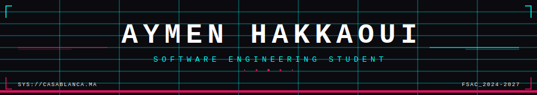

<div align="center">



<br>


<br>

<p align="center">
  <a href="mailto:aymenhakkaoui41@gmail.com">
    
  </a>
  <a href="https://github.com/TheDeadShadow47">
    
  </a>
  <a href="#">
    
  </a>
</p>


</div>


```
> IDENTITY   :: Aymen HAKKAOUI
> LOCATION   :: Casablanca, Morocco
> INSTITUTE  :: Faculté des Sciences Aïn Chock — B.Sc. Dev. Informatique (2024–2027)
> FOCUS      :: Systems Programming · Full-Stack · React
> STATUS     :: [ BUILDING ]
```


## `// ACTIVE BUILDS`

> **Mini OS Kernel** `[C]`
> Expanding a lightweight kernel from scratch — memory management, process scheduling, low-level system design. Learning by building the thing that runs everything else.

> **React & Node.js** `[learning]`
> Pushing into full-stack territory. React for UI, Node for the backend. Next project will use both.


## `// PROJECTS`

[](https://github.com/TheDeadShadow47/Cyberpunk-themed-portfolio)
[](https://github.com/TheDeadShadow47/Quiz-for-learning-js-react-dom-npm)
[](https://github.com/TheDeadShadow47/Mini_os_kernel)
[](https://github.com/TheDeadShadow47/Universal-Lead-Dashboard)
[](https://github.com/TheDeadShadow47/Student-Grades-Management-System)
[](https://github.com/TheDeadShadow47/Snakegame-with-sfml)

<div align="center">
  <a href="https://github.com/TheDeadShadow47/Cyberpunk-themed-portfolio">
    
  </a>
  <a href="https://github.com/TheDeadShadow47/Quiz-for-learning-js-react-dom-npm">
    
  </a>
  <a href="https://github.com/TheDeadShadow47/Mini_os_kernel">
    
  </a>
  <a href="https://github.com/TheDeadShadow47/Universal-Lead-Dashboard">
    
  </a>
  <a href="https://github.com/TheDeadShadow47/Student-Grades-Management-System">
    
  </a>
  <a href="https://github.com/TheDeadShadow47/Snakegame-with-sfml">
    
  </a>
</div>


## `// PHILOSOPHY`

```
It is the privilege of the gods to want nothing, and of godlike men to want little.
```


<div align="center">
<sub><code>[ END OF FILE — TheDeadShadow47 ]</code></sub>
</div>
